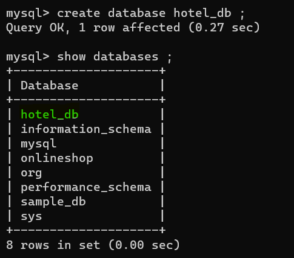
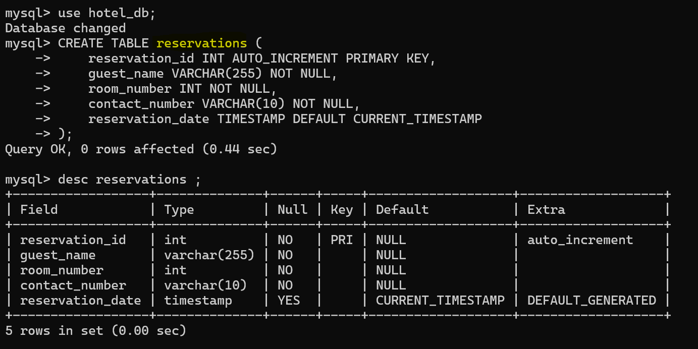

# Hotel Management System

Welcome to the Hotel Management System! This system allows users to manage hotel reservations through a command-line interface.

## Features

### 1. Reserve a Room

- Allows users to reserve a room by providing guest name, room number, and contact number.
- Validates and stores the reservation details in the database.

### 2. View Reservations

- Displays a list of all current reservations with details such as reservation ID, guest name, room number, contact number, and reservation date.

### 3. Get Room Number

- Retrieves and displays the room number for a specific reservation ID and guest name.

### 4. Update Reservations

- Enables users to update existing reservations with new guest name, room number, and contact number.
- Checks for the existence of the reservation before updating.

### 5. Delete Reservations

- Allows users to delete a reservation by providing the reservation ID.
- Checks for the existence of the reservation before deletion.

### 6. Exit

- Exits the Hotel Management System.

## Database - MySQL 
### Creation of Database
1. Open your MySQL client or command-line interface.
2. Execute the following SQL command to create the database named `hotel_db`:




### Creation of Tables 


## Getting Started

Follow the steps below to set up and run the Hotel Management System:

### Prerequisites

- Java Development Kit (JDK) installed.
- MySQL database server installed.
- Eclipse IDE installed

### Setup

+   Clone the repository:
    ```bash
    git clone https://github.com/anchals0915/Hotel-Reservation-System.git
+   Import the project into Eclipse.
+   Create a MySQL database named hotel_db and update the database connection details in the Main.java file.
+   Run the application.

### Contributing
+ Contributions are welcome! If you find any issues or have improvements to suggest, feel free to open an issue or submit a pull requests.
